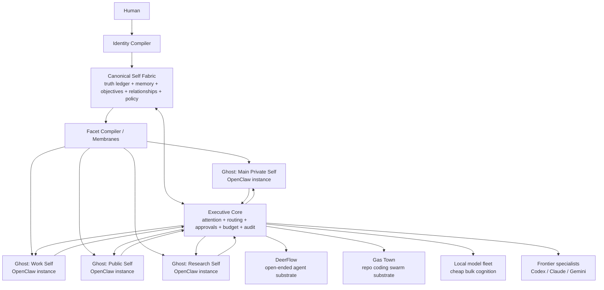
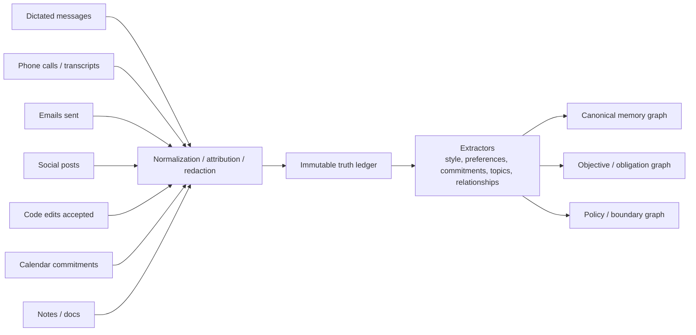
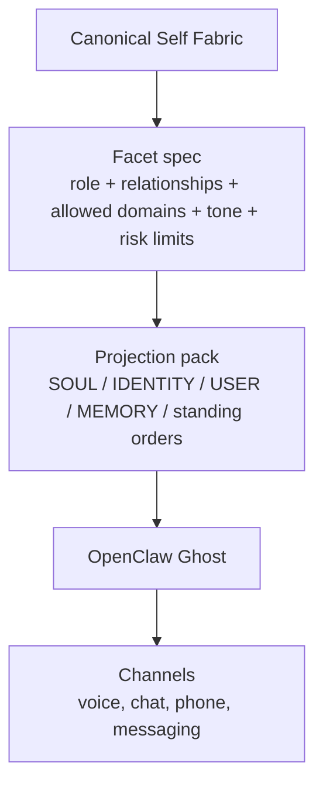
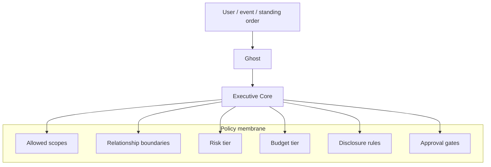
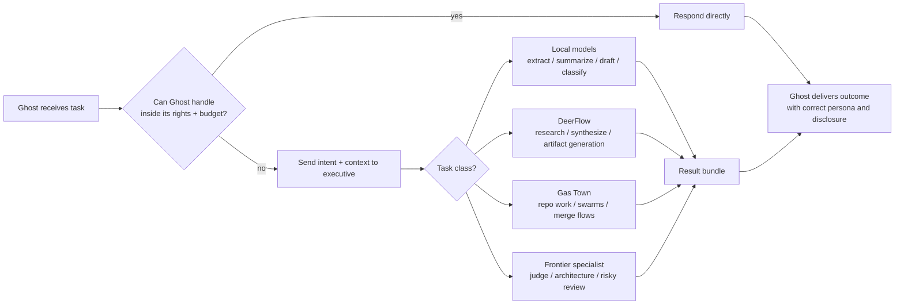
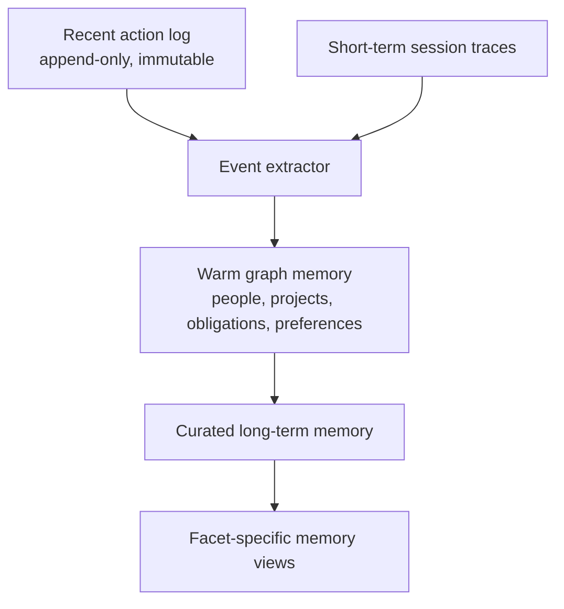

# Exocortex / Ghost Architecture Notes

## Thesis

- **Canonical self is not the same thing as a Ghost.**
- A **Ghost** is an embodied, channel-facing projection of self with bounded authority.
- **OpenClaw** is a strong runtime for Ghosts.
- **Your exocortex core** should remain the executive and source of truth.

## Core definitions

- **Canonical Self Fabric**: ground-truth ledger + autobiographical memory + preference graph + objective graph + relationship graph + policy graph.
- **Identity Compiler**: converts authored human outputs into a canonical self model.
- **Facet Compiler**: produces bounded projections of self for contexts like work, public, research, or family.
- **Ghost**: an OpenClaw agent/workspace/session bundle powered by one facet projection.
- **Executive Core**: policy, routing, salience, objective management, approval, audit.
- **Worker Fabrics**: DeerFlow for open-ended work, Gas Town for repo-centric coding swarms, local/frontier models for direct tasks.

## Diagram 1 — top-level stack

## Diagram 2 — human-out ingestion

## Diagram 3 — Ghost as embodied projection

## Diagram 4 — authority membrane

## Diagram 5 — deeper work escalation

## Diagram 6 — memory promotion

## Suggested control principles

1. **Whole self is not an API.** Every Ghost gets a bounded projection, not the raw total self.
2. **Ghosts do not own truth.** They consume truth and produce actions.
3. **Canonical truth must be append-only first, summarized second.**
4. **Every outward action writes to the action ledger before or at execution time.**
5. **Facet projection is explicit.** Work-self, public-self, partner-self, research-self should not silently bleed into one another.
6. **High-risk acts route through approval or frontier review.**
7. **OpenClaw is embodiment; the exocortex core is sovereignty.**

## One-line operating model

**Human outputs train the canonical self; the canonical self compiles bounded facets; bounded facets animate Ghosts; Ghosts invoke the executive; the executive routes into worker fabrics; all actions flow back into the truth ledger.**
